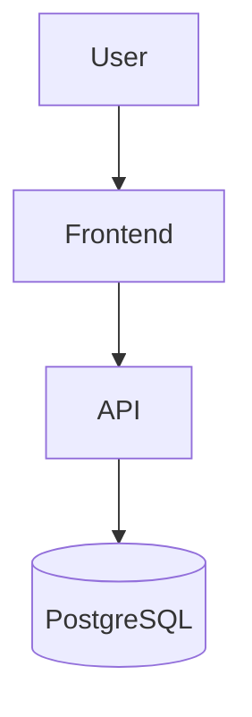
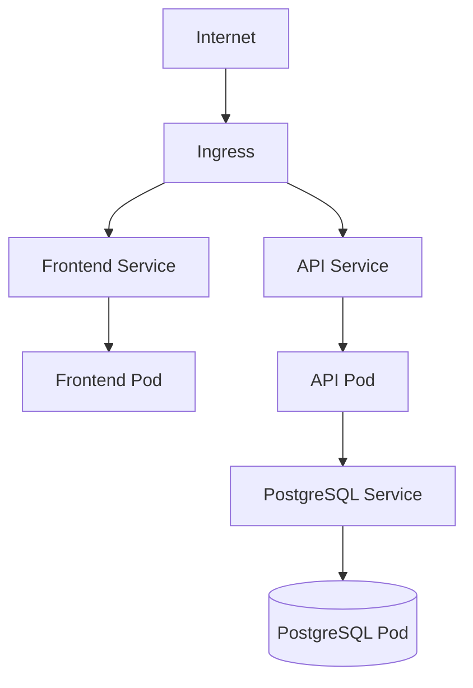

# TaskFlow

TaskFlow is a small cloud-native task management application composed of a Node.js API, a static frontend, PostgreSQL, and Kubernetes deployment assets. The repository is structured so the same application can be run locally with Docker Compose and deployed to a Kubernetes cluster with a single kustomization entrypoint.

## Architecture

### Docker Compose



### Kubernetes



## Repository layout

```text
.
├── apps/
│   ├── api/
│   └── frontend/
├── k8s/
│   ├── namespace.yaml
│   ├── configmap.yaml
│   ├── secret.yaml
│   ├── postgres/
│   │   ├── deployment.yaml
│   │   ├── service.yaml
│   │   └── pvc.yaml
│   ├── api/
│   │   ├── deployment.yaml
│   │   └── service.yaml
│   ├── frontend/
│   │   ├── deployment.yaml
│   │   └── service.yaml
│   ├── ingress/
│   │   └── ingress.yaml
│   └── kustomization.yaml
├── docker-compose.yml
├── .env.example
├── README.md
└── .github/
    └── workflows/
```

## Local development with Docker Compose

1. Copy the example environment file:
   ```bash
   cp .env.example .env
   ```
2. Start the stack:
   ```bash
   docker compose up --build
   ```
3. Access the application:
   - Frontend: http://localhost:8080
   - API: http://localhost:3000
   - Health check: http://localhost:3000/healthz

## Build Docker images

```bash
docker build -t taskflow-api:local ./apps/api
docker build -t taskflow-frontend:local ./apps/frontend
```

## Deploy to Kubernetes

1. Create the namespace and resources:
   ```bash
   kubectl apply -k k8s/
   ```
2. Verify that the pods are running:
   ```bash
   kubectl get pods -n taskflow
   ```
3. If you use an ingress controller, add the host entry:
   ```bash
   echo "127.0.0.1 taskflow.local" | sudo tee -a /etc/hosts
   ```
4. Open the application at http://taskflow.local

## Configuration

The application uses environment variables for database and service settings. The Kubernetes manifests read values from the ConfigMap and Secret, while Docker Compose consumes values from the local .env file.

## CI/CD

The GitHub Actions workflow builds the application images on pushes to main and publishes them to Docker Hub when a version tag like v1.0.0 is created. The workflow expects the following secrets:

- DOCKERHUB_USERNAME
- DOCKERHUB_TOKEN
